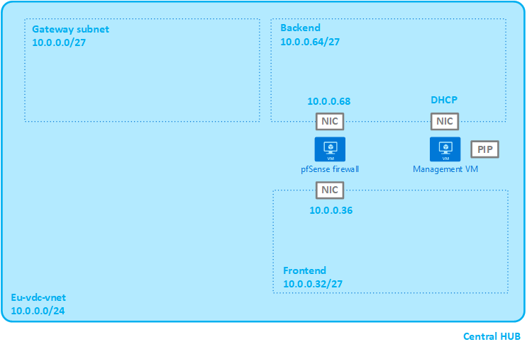

# AzurePfSense

## Introduction

These ARM templates deploy a pfSense NVA in Azure using linked templates. It creates the following environment:

* Virtual Network with 3 subnets
    * Gateway subnet (for future use)
    * Front-end subnet (WAN side)
    * Back-end subnet (LAN side)
* Managed disk from vhd
* pfSense virual machine
* Virtual machine to manage the pfSense NVA

This repository is used to support the *pfSense on Azure* blog post series on [https://www.christofvg.be](https://www.christofvg.be):

* [pfSense on Azure - Part 1 - Create pfSense Virtual Machine](https://www.christofvg.be/2019/01/12/pfSense-on-Azure-Part-1-Create-pfSense-Virtual-Machine/)
* [pfSense on Azure - Part 2 - Install pfSense](https://www.christofvg.be/2019/01/12/pfSense-on-Azure-Part-2-Install-pfSense/)
* [pfSense on Azure - Part 3 - Deploy pfSense in Azure](https://www.christofvg.be/2019/01/12/pfSense-on-Azure-Part-3-Deploy-pfSense-in-Azure/)
* [pfSense on Azure - Part 4 - Deploy pfSense in Azure with ARM templates](https://www.christofvg.be/2019/01/23/pfSense-on-Azure-Part-4-Deploy-pfSense-in-Azure-with-ARM-templates/)

## Design

Here a visual representation of the design:



## Parameters

All parameters are passed to the 'main' ARM template azuredeploy.json. They are forwarded to the linked templates. Here an overview per linked template:

>*Convention: [data type]name in the linked template(name in the main template): description*

### virtualNetwork.json

[string]location: The Azure location to deploy all resources  
[string]vNetName: The name for the virtual network  
[string]vNetAddressPrefix: The address prefix for the virtual network  

>**[array]vNetSubnets**  
>The subnets are passed to the virtualNetwork.json ARM template as parameters, but the array is built from the separate subnet parameters:
>* Gateway subnet
>   * [string]gatewaySubnetName
>   * [string]gatewaySubnetAddressPrefix
>* Front-end subnet
>   * [string]frontEndSubnetName
>   * [string]frontEndSubnetAddressPrefix
>* Back-end subnet
>   * [string]backEndSubnetName
>   * [string]backEndSubnetAddressPrefix

### managedDisk.json

[string]location: The Azure location to deploy all resources  
[string]storageType(managedDiskStorageType): Storage type for the managed disk  
[string]sourceVhdPath: Path to the vhd file on the storage account  
[string]storageAccountName(vhdStorageAccountName): Name of the storage account where the vhd file is stored  
[string]osType: OS Type of the image on the managed disk  
[string]managedDiskName: Name for the managed disk  

### pfSense.json

[string]location: The Azure location to deploy all resources  
[string]frontEndNicName: Name for the front-end NIC  
[string]backEndNicName: Name for the back-end NIC  
[string]frontEndIp: IP for the front-end NIC  
[string]backEndIp: IP for the back-end NIC  
[string]vNetName: Name for the pfSense instance  
[string]vNetResouceGroupName(virtualNetworkResourceGroup): The resource group where to deploy the virtual network  
[string]frontEndSubnetName: The name of the front-end subnet  
[string]backEndSubnetName: The name of the back-end subnet  
[string]vmName: Name for the pfSense instance  
[string]vmSize: Size for the pfSense instance  
[string]managedDiskName: Name for the managed disk  
[string]osType: OS Type of the image on the managed disk  

### managementVM.json

[string]managementVmName: Name for the management virtual machine  
[string]publicIpAddressName(managementVmPublicIpAddressName): Name for the management virtual machine public ip address  
[string]managementVmNicName: Name for the management virtual machine nic  
[string]managementVmAdminUserName: Management virtual machine username  
[string]managementVmPassword: Management virtual machine password  
[string]managementVmDiskType: Management virtual machine virtual disk type  
[string]managementVmOSDiskName: Management virtual machine OS disk name  
[string]managementVmSize: Management virtual machine size  
[string]managementVmOSVersion: Management virtual machine OS version  
[string]location: The Azure location to deploy all resources  
[string]vNetResourceGroupName(virtualNetworkResourceGroup): The resource group where to deploy the virtual network  
[string]vNetName: The name for the virtual network  
[string]backEndSubnetName: The name of the back-end subnet  

### Resource Groups

Resource groups are also deployed by the ARM template. Therefore, parameters with the names for the resource groups are also needed.

[string]virtualNetworkResourceGroup: The resource group where to deploy the virtual network  
[string]pfSenseResourceGroup: The resource group where to deploy pfSense  
[string]managementVmResourceGroup: The resource group where to deploy the management virtual machine  

>**Security**  
>The parameters *vhdStorageAccountName* and *managementVmAdminPassword* are not mentioned in the parameters file to prevent sensitive data in source control. They can be passed to the deployment as extra parameter.

## Deployment

To deploy the ARM teplate using PowerShell:

```PowerShell
New-AzureRmDeployment -Location <location> -TemplateFile <path to azuredeploy.json> -TemplateParameterFile <path to azuredeploy.parameters.json> -vhdStorageAccountName <storageAccountName> -managementVmAdminPassword <password> -Verbose
```

## Social

Please don't hesitate to leave me some feedback on twitter [@cvangeendert](https://twitter.com/cvangeendert).